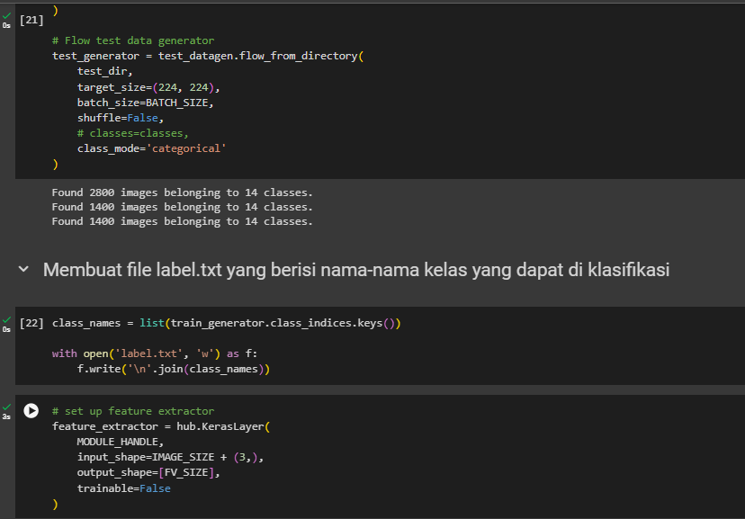
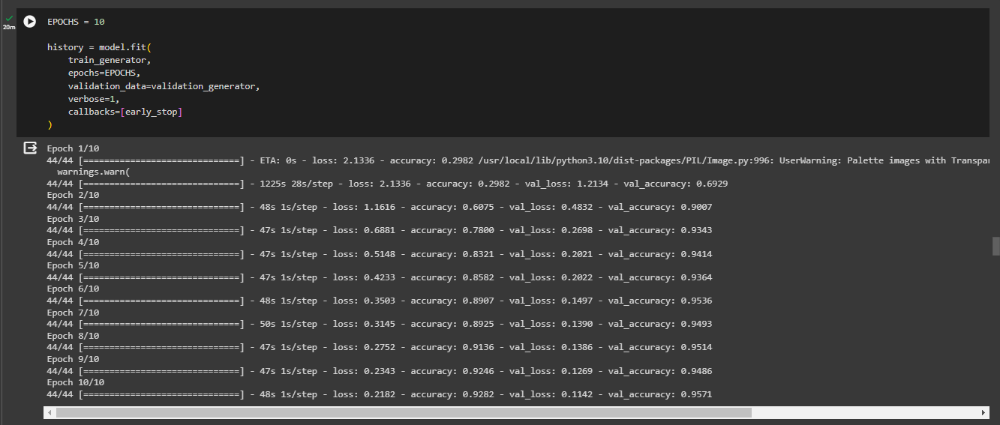
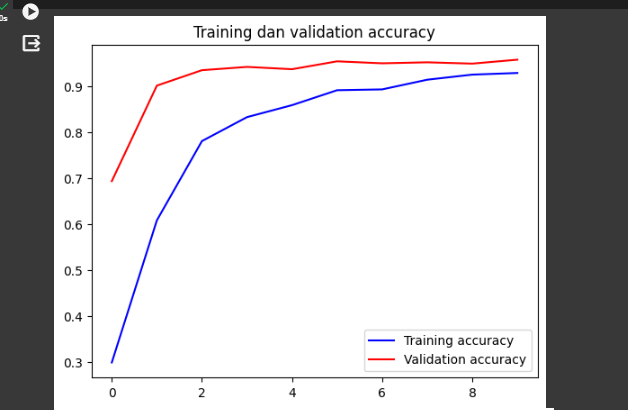
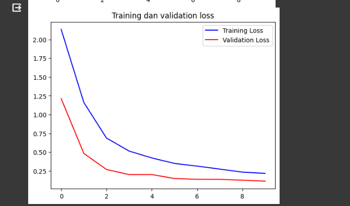
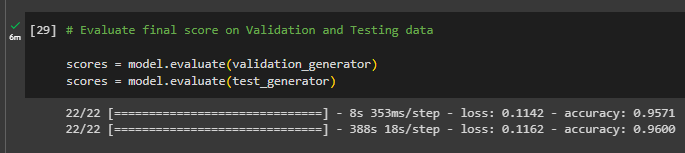
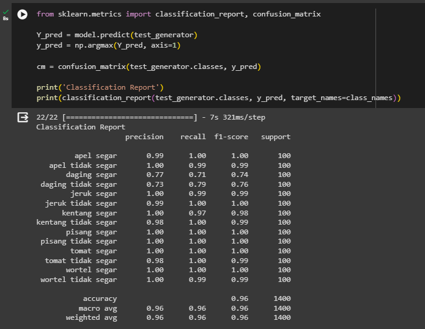
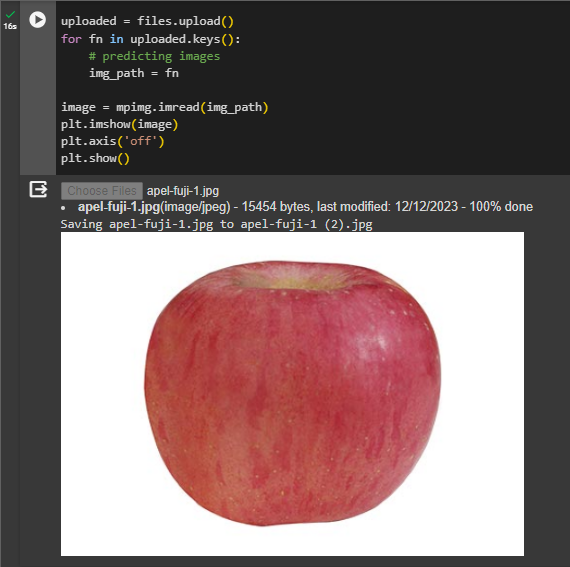
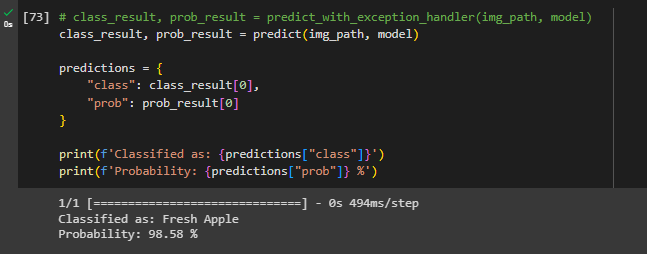

<h1 align="center">
 
  
   
   FRESHEATS
   
</h1>

## Our Capstone Team
- Zahra Putri Zanuarti - Universitas Ahmad Dahlan – Machine Learning
- Fatih Fauzan Kartamanah - UIN Sunan Gunung Djati Bandung – Machine Learning
- Aldi Yoga Setiawan - Institut Teknologi Telkom Purwokerto – Machine Learning
- Fahrizky Syihabudin Ibrahim - Universitas Ahmad Dahlan – Cloud Computing
- Mohammad Dava Aditya - Institut Teknologi Sepuluh Nopember – Cloud Computing
- Muhammad Rizki Alamsyah - Universitas Ahmad Dahlan – Mobile Development

## Roles 
- Project Manager - Zahra Putri Zanuarti
- Build Machine Learning Model - Zahra Putri Zanuarti, Fatih Fauzan Kartamanah, Aldi Yoga Setiawan
- Cloud and Deployment App - Fahrizky Syihabudin Ibrahim, Mohammad Dava Aditya
- Android Development - Muhammad Rizki Alamsyah
- Create UI/UX - Muhammad Rizki Alamsyah

## Capstone Project Background 
Food freshness is one of the main parameters in assessing the sustainability of its quality. Food quality is closely related to the freshness of food ingredients, which impacts on flavor, aroma, texture, as well as our health and safety. The choice of fresh ingredients is not only to fulfill culinary satisfaction, but also to ensure that the body receives the best nutrition. Food freshness reflects optimal farming and distribution practices, reducing the risk of contamination and illness that can arise from improper handling.

Focusing on the freshness of food can support the improvement of personal quality of life and the creation of a sustainable food system. In the modern era of technology, innovative solutions such as Fresheats digitize the activity of checking the freshness of food. Fresheats provides information about the freshness of food ingredients and utilizes scanning technology for rapid quality assessment. This approach is not only practical but also supports a healthy and sustainable lifestyle in the digital age.

##
# MACHINE LEARNING PROJECT

### Machine Learning Project Overview
We aim to create an app that can assist users in determining whether food ingredients are fresh or not with utilize machine learning model.Our machine learning model using CNN method with MobileNet architecture. Model building uses Keras and the TensorFlow framework, the model training results will be stored in the TensorFlow Lite file and imported into the project in Android Studio. 

### Dataset
The data used are fruit, vegetable, and beef data. 
- Fruit Include : Fresh Apple, Fresh Banana, Fresh Orange, Stale Apple, Stale Banana, Stale Orange.
- Vegetable Include : Fresh Tomato, Fresh Carrot, Fresh Potato, Stale Tomato, Stale Carrot, Stale Potato.
- Beef Include : Fresh Beef, Stale Beef

More details
- Train : we have 2800 images in total for train
- valid : we have 1400 images in total for valid
- test  : we have 1400 images in total for test

Our dataset can see at [here dataset](https://drive.google.com/drive/folders/1LUxMwH_F943Jt-5u5bG8CUcSDtth2gU2?usp=drive_link )

# Training and Testing Machine Learning Model
This Preview Our Training and Testing ML Model

</img>

</img>

</img>

</img>

</img>

</img>

</img>

</img>
